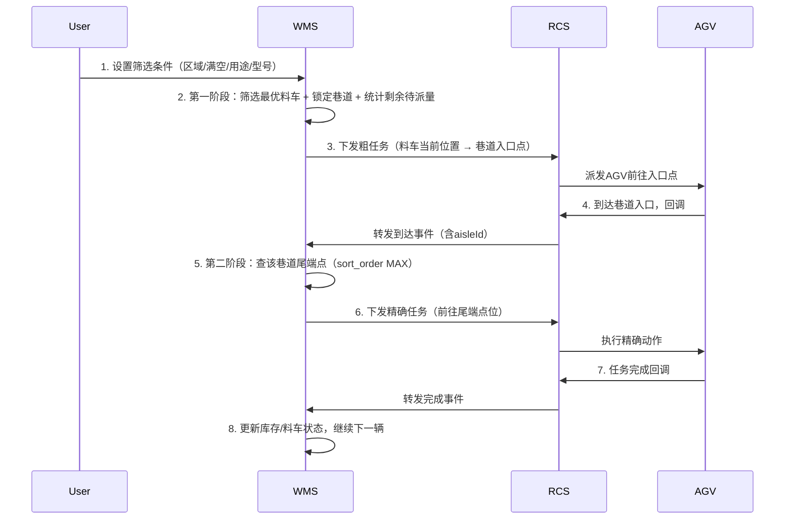
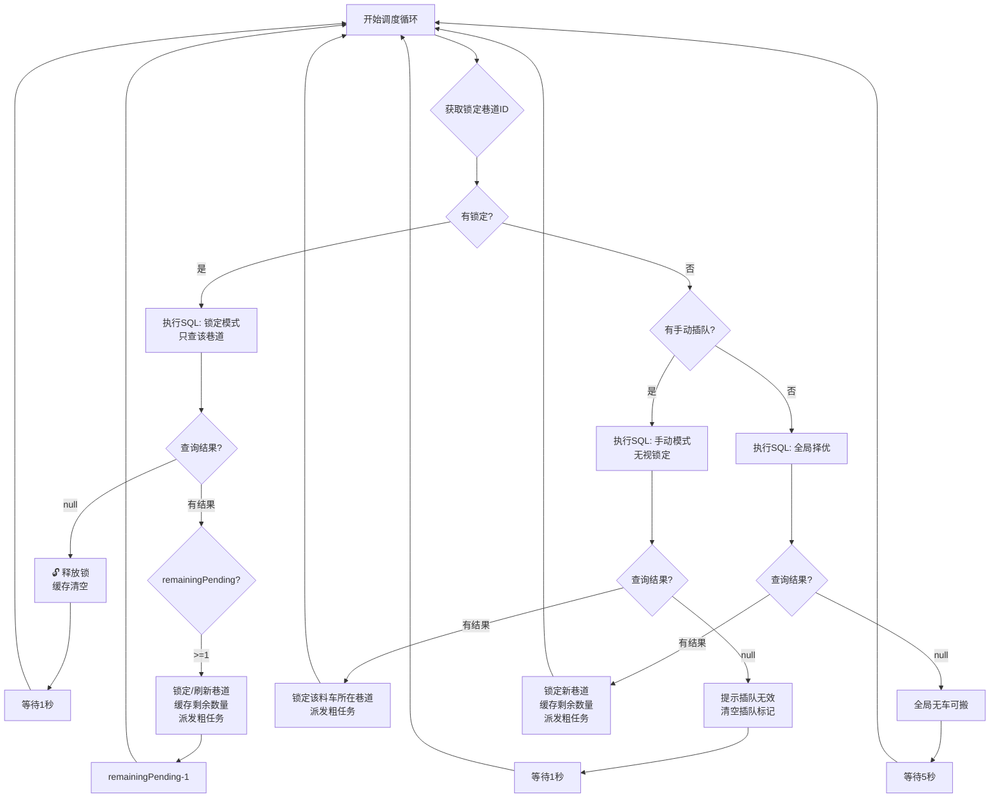

好的，我将把完整的方案整合到《任务编排方案.md》中，形成一份完整的文档。

---

# WMS 满载料车智能调度与巷道锁定搬运方案

## 一、方案背景与目标

### 1.1 业务背景
在陶瓷/制造行业的 WMS 系统中，满载/空载料车需要被 AGV 搬运至指定位置。系统需在**用户自定义筛选**与**人工干预**两种模式下，高效、有序地完成搬运任务。

### 1.2 核心目标
1. **用户自定义筛选**：用户可按区域、料车状态（满车/空车）、巷道用途、货架型号等多维度筛选，灵活控制搬运范围。
2. **巷道锁定连续搬运**：一旦选中某个巷道，系统锁定该巷道，持续处理其中所有符合条件的料车，直到该巷道无可派发料车，才释放锁并重新筛选。
3. **两阶段动态调度**：
   - **第一阶段**：选出最优料车并锁定巷道，将 AGV 派往巷道入口。
   - **第二阶段**：AGV 到达入口后回传信息，系统查该巷道尾端点位（`sort_order` 最大），下发精确动作。
4. **动态限流防拥堵**：通过判断巷道内“剩余可派发料车数”（排除已在路上的），防止向同一巷道超发 AGV 造成拥堵。
5. **人工插队干预**：允许用户手动指定某辆具体料车优先处理，执行后自动转入该料车所在巷道的锁定搬运模式。

### 1.3 两阶段调度流程图




## 二、用户筛选维度

| 筛选维度 | 是否必填 | 说明 |
|---------|---------|------|
| **区域**（`locationId`） | ✅ 是 | 业务操作范围 |
| **料车状态**（`loadType`） | ✅ 是 | `FULL`（满车）或 `EMPTY`（空车） |
| **巷道用途**（`aislePurpose`） | ❌ 否 | `FULL` / `MIXED` / `EMPTY` |
| **货架型号**（`modelCode`） | ❌ 否 | 如 `LJ-01` |

### 2.1 满车/空车判断逻辑

| 场景 | 判断条件 |
|------|----------|
| **满车（FULL）** | `c.status = 3` 且 `c.current_quantity = COALESCE(c.actual_capacity, cm.max_capacity)` |
| **空车（EMPTY）** | `c.status = 1` 且 `c.current_quantity = 0` |


## 三、核心业务规则

### 3.1 料车排序规则（第一阶段）

用户筛选条件确定后，系统在筛选范围内按以下规则排序（由高到低）：

| 优先级 | 排序字段 | 规则 |
|--------|----------|------|
| 1 | `ci.arrive_time`（料车落位时间） | 越早落位越优先（先进先出） |
| 2 | `p.sort_order`（点位排序号） | 数字越小越优先 |

> **说明**：用户已手动筛选，无需再按巷道用途（FULL/MIXED/EMPTY）排序。

### 3.2 巷道锁定规则
- 当系统选出一辆料车后，**立即锁定该料车所在的整个巷道**。
- 后续所有查询（在锁释放前）**只从该巷道内取车**，忽略其他巷道。
- 巷道内取车排序：`arrive_time ASC`（先进先出）+ `p.sort_order ASC`。
- 当该巷道内**无任何符合条件的待派发料车**时，**释放巷道锁**，下次查询恢复全局筛选。

### 3.3 剩余可派发数量计算（核心）

```sql
remaining_pending = total_in_aisle - assigned_in_aisle
```

| 字段 | 含义 |
|------|------|
| `total_in_aisle` | 该巷道内符合用户筛选条件的料车总数 |
| `assigned_in_aisle` | 该巷道内已有进行中任务（`status IN (0,1,2)`）的料车数 |
| `remaining_pending` | **真正可派发的料车数**（含当前查询返回的这辆） |

### 3.4 巷道锁定/解锁决策表

| 当前状态 | 查询结果 | 行为 |
|---------|---------|------|
| 无锁定 | 有结果 | 锁定新巷道，派发任务 |
| 无锁定 | 无结果 | 等待（全局无车） |
| 有锁定 | 有结果（同巷道） | 继续锁定，派发任务 |
| 有锁定 | 有结果（不同巷道） | 释放原锁，锁定新巷道（自动切换） |
| 有锁定 | 无结果 | 释放锁（该巷道已无可派发车） |

### 3.5 人工插队规则
- 用户手动指定一辆料车时，**无条件最高优先级**。
- 查询直接锁定该料车，忽略当前是否有巷道锁。
- 该料车被选中后，**自动锁定其所在巷道**，后续转入巷道锁定连续搬运模式。


## 四、核心 SQL 设计

### 4.1 参数说明

| 参数名 | 类型 | 含义 | 取值示例 |
|--------|------|------|---------|
| `#{locationId}` | BIGINT | 区域ID（必填） | `2092541527078227969` |
| `#{loadType}` | VARCHAR | 满/空（必填） | `FULL` 或 `EMPTY` |
| `#{aislePurpose}` | VARCHAR | 巷道用途（可选） | `FULL` / `MIXED` / `EMPTY` 或 `NULL` |
| `#{modelCode}` | VARCHAR | 货架型号（可选） | `LJ-01` 或 `NULL` |
| `#{lockedAisleId}` | BIGINT | 当前锁定巷道ID（无锁传 `NULL`） | `123456` 或 `NULL` |
| `#{manualCartId}` | BIGINT | 用户手动指定的料车ID | `987654` 或 `NULL` |

### 4.2 第一阶段 SQL（筛选料车 + 锁定巷道 + 统计剩余量 + 返回入口点）

```sql
WITH qualified_carts AS (
    SELECT 
        ci.cart_id,
        c.cart_code,
        ci.point_id,
        ci.arrive_time,
        p.aisle_id,
        a.aisle_purpose,
        a.aisle_code,
        -- 当前巷道内符合条件的总车数
        COUNT(*) OVER (PARTITION BY p.aisle_id) AS total_in_aisle,
        -- 当前巷道内已被指派任务的料车数（任务状态 0/1/2）
        COUNT(CASE WHEN t.id IS NOT NULL AND t.status IN (0, 1, 2) THEN 1 END) 
            OVER (PARTITION BY p.aisle_id) AS assigned_in_aisle
    FROM wms_cart_inventory ci
    JOIN wms_cart c ON ci.cart_id = c.id
    JOIN wms_cart_model cm ON c.model_id = cm.id
    JOIN wms_point p ON ci.point_id = p.id
    JOIN wms_aisle a ON p.aisle_id = a.id
    -- 左连接任务表，判断该料车是否正在搬运中
    LEFT JOIN wms_rcs_task t ON t.cart_code = c.cart_code 
                             AND t.status IN (0, 1, 2)
    WHERE 
        ci.cart_id IS NOT NULL
        AND ci.lock_status = 0
        -- 满车/空车过滤
        AND (
            ( #{loadType} = 'FULL' 
              AND c.status = 3 
              AND c.current_quantity = COALESCE(c.actual_capacity, cm.max_capacity) )
            OR
            ( #{loadType} = 'EMPTY' 
              AND c.status = 1 
              AND c.current_quantity = 0 )
        )
        -- 可选：巷道用途过滤
        AND ( #{aislePurpose} IS NULL OR a.aisle_purpose = #{aislePurpose} )
        -- 可选：货架型号过滤
        AND ( #{modelCode} IS NULL OR a.model_code = #{modelCode} )
        AND p.status = 1
        AND a.status = 1
        AND p.location_id = #{locationId}
        -- 三种调度模式
        AND (
            ( #{manualCartId} IS NOT NULL AND ci.cart_id = #{manualCartId} )
            OR
            ( #{manualCartId} IS NULL AND #{lockedAisleId} IS NOT NULL AND p.aisle_id = #{lockedAisleId} )
            OR
            ( #{manualCartId} IS NULL AND #{lockedAisleId} IS NULL )
        )
),
selected_cart AS (
    SELECT 
        *,
        ROW_NUMBER() OVER (
            ORDER BY 
                CASE WHEN #{manualCartId} IS NOT NULL THEN 0 ELSE 1 END,
                CASE WHEN #{lockedAisleId} IS NOT NULL THEN 0 ELSE 1 END,
                arrive_time ASC,
                sort_order ASC
        ) AS rn
    FROM qualified_carts
)
SELECT 
    sc.cart_id,
    sc.cart_code,
    sc.point_id AS current_point_id,
    sc.arrive_time,
    sc.aisle_id,
    sc.aisle_code,
    sc.aisle_purpose,
    -- 剩余可派发数量 = 总数 - 已指派数
    (sc.total_in_aisle - sc.assigned_in_aisle) AS remaining_pending,
    sc.total_in_aisle,
    sc.assigned_in_aisle,
    -- 巷道入口点（sort_order 最小）
    entry.id AS entry_point_id,
    entry.point_code AS entry_point_code,
    entry.coordinate AS entry_coordinate
FROM selected_cart sc
JOIN wms_point entry ON entry.aisle_id = sc.aisle_id
WHERE 
    sc.rn = 1
    AND entry.status = 1
    AND entry.sort_order = (
        SELECT MIN(sort_order) 
        FROM wms_point 
        WHERE aisle_id = sc.aisle_id AND status = 1
    );
```

### 4.3 第一阶段 SQL 返回字段说明

| 字段 | 说明 |
|------|------|
| `cart_id` | 选中的料车ID |
| `cart_code` | 料车编号 |
| `current_point_id` | 料车当前所在点位ID |
| `arrive_time` | 料车落位时间 |
| `aisle_id` | 所属巷道ID（用于锁定） |
| `aisle_code` | 巷道编码 |
| `aisle_purpose` | 巷道用途 |
| `total_in_aisle` | 该巷道符合条件的料车总数 |
| `assigned_in_aisle` | 该巷道已指派（在路上）的料车数 |
| `remaining_pending` | **剩余可派发数**（含当前这辆） |
| `entry_point_id` | 巷道入口点位ID |
| `entry_point_code` | 巷道入口点位编码 |
| `entry_coordinate` | 巷道入口地图坐标 |

### 4.4 第二阶段 SQL（AGV 到达回调后 → 查巷道尾端）

```sql
-- 第二阶段：根据 aisleId 直接取尾端（sort_order 最大）
SELECT 
    p.id AS tail_point_id,
    p.point_code AS tail_point_code,
    p.sort_order AS tail_sort_order,
    p.coordinate AS tail_coordinate
FROM wms_point p
WHERE 
    p.aisle_id = #{aisleId}   -- 从 AGV 回调中拿到
    AND p.status = 1
ORDER BY p.sort_order DESC
LIMIT 1;
```


## 五、应用层调度逻辑

### 5.1 状态存储设计

建议使用 **Redis** 存储当前锁定的巷道ID。

| Key | Value | TTL | 说明 |
|-----|-------|-----|------|
| `wms:locked_aisle:{locationId}` | 巷道ID | 300秒 | 当前区域锁定的巷道，每次派发任务后刷新TTL |
| `wms:aisle:remaining:{locationId}` | 剩余待派数 | 300秒 | 供前端展示进度 |

**工具类接口定义：**
```java
public interface AisleLockManager {
    Long getLockedAisleId(Long locationId);
    void lockAisle(Long locationId, Long aisleId);
    void unlockAisle(Long locationId);
    boolean isLocked(Long locationId);
    void refreshTTL(Long locationId);
}
```

### 5.2 调度器完整实现（Java + Spring Boot）

```java
@Component
public class CartDispatchScheduler {

    private static final Logger log = LoggerFactory.getLogger(CartDispatchScheduler.class);

    @Autowired
    private CartDispatchMapper dispatchMapper;
    
    @Autowired
    private AisleLockManager lockManager;
    
    @Autowired
    private RcsTaskService rcsTaskService;
    
    @Autowired
    private CacheManager cacheManager;

    /**
     * 获取当前用户筛选条件（从会话/请求上下文获取）
     */
    private DispatchFilter getCurrentFilter() {
        // 实际项目中从 SecurityContext / 请求上下文 获取
        return DispatchFilter.builder()
            .locationId(2092541527078227969L)
            .loadType("FULL")
            .aislePurpose(null)      // 可选
            .modelCode("LJ-01")      // 可选
            .build();
    }

    @Scheduled(fixedDelay = 2000)  // 每2秒执行一次
    public void dispatchLoop() {
        DispatchFilter filter = getCurrentFilter();
        Long locationId = filter.getLocationId();
        
        // 1. 获取当前锁定巷道 & 手动插队请求
        Long lockedAisleId = lockManager.getLockedAisleId(locationId);
        Long manualCartId = ManualCartQueue.pollPending(locationId);
        
        // 2. 第一阶段查询
        DispatchResult result = dispatchMapper.selectOptimalCart(
            locationId,
            filter.getLoadType(),
            filter.getAislePurpose(),
            filter.getModelCode(),
            lockedAisleId,
            manualCartId
        );
        
        // ==================== 情况1：无结果 ====================
        if (result == null) {
            if (lockedAisleId != null) {
                lockManager.unlockAisle(locationId);
                cacheManager.evict("wms:aisle:remaining:" + locationId);
                log.info("巷道 {} 已无待派发料车，释放锁", lockedAisleId);
            } else {
                log.debug("当前筛选条件下无可搬运料车，等待中...");
            }
            return;
        }
        
        // ==================== 情况2：有结果 ====================
        int remainingPending = result.getRemainingPending();
        Long resultAisleId = result.getAisleId();
        
        // 3. 处理巷道切换（原锁定巷道已无待派车，全局择优查到了新巷道）
        if (lockedAisleId != null && !resultAisleId.equals(lockedAisleId)) {
            lockManager.unlockAisle(locationId);
            log.info("自动切换巷道: {} → {}（原巷道已无待派车）", 
                     lockedAisleId, resultAisleId);
        }
        
        // 4. 锁定新巷道（如果是首次锁定 或 切换了巷道）
        if (lockManager.getLockedAisleId(locationId) == null) {
            lockManager.lockAisle(locationId, resultAisleId);
            log.info("锁定新巷道: {}, 剩余待派: {} 辆", 
                     resultAisleId, remainingPending);
        }
        
        // 5. 刷新TTL并缓存剩余数量（供前端展示）
        lockManager.refreshTTL(locationId);
        cacheManager.put("wms:aisle:remaining:" + locationId, remainingPending);
        
        // 6. 日志记录最后一辆
        if (remainingPending <= 1) {
            log.info("巷道 {} 最后一辆可派发料车: {}", resultAisleId, result.getCartCode());
        }
        
        // 7. 派发粗任务（料车当前位置 → 巷道入口点）
        boolean success = rcsTaskService.submitRoutingTask(
            result.getCartCode(),
            result.getCurrentPointId(),
            result.getEntryPointId(),
            resultAisleId,
            filter.getLoadType()
        );
        
        if (success) {
            log.info("粗任务已派发: 料车 {} → 巷道 {} 入口点 {}, 该巷道剩余待派: {} 辆", 
                     result.getCartCode(), result.getAisleCode(), 
                     result.getEntryPointCode(), remainingPending - 1);
        } else {
            log.error("粗任务派发失败，料车: {}", result.getCartCode());
            // 失败重试或告警
            handleDispatchFailure(result);
        }
    }
}
```

### 5.3 AGV 到达回调处理器（第二阶段）

```java
@Component
public class AgvArrivalHandler {

    private static final Logger log = LoggerFactory.getLogger(AgvArrivalHandler.class);

    @Autowired
    private PointMapper pointMapper;
    
    @Autowired
    private RcsTaskService rcsTaskService;

    /**
     * 处理 AGV 到达巷道入口的回调事件
     */
    @EventListener
    public void handleAgvArrival(AgvArrivalEvent event) {
        Long aisleId = event.getAisleId();
        String agvCode = event.getAgvCode();
        
        log.info("AGV {} 到达巷道 {} 入口", agvCode, aisleId);
        
        // 1. 查询该巷道尾端点位（sort_order 最大）
        TailPoint tail = pointMapper.findTailPointByAisleId(aisleId);
        
        if (tail == null) {
            log.error("巷道 {} 无可用尾端点", aisleId);
            // 异常处理：通知RCS让AGV原地等待或执行其他指令
            rcsTaskService.sendWaitingCommand(agvCode, "等待人工处理");
            return;
        }
        
        // 2. 下发精确任务：AGV 从当前位置移动到尾端
        boolean success = rcsTaskService.submitPreciseTask(
            agvCode,
            tail.getTailPointCode(),
            tail.getTailCoordinate()
        );
        
        if (success) {
            log.info("精确任务已下发: AGV {} → 尾端点 {} ({})", 
                     agvCode, tail.getTailPointCode(), tail.getTailCoordinate());
        } else {
            log.error("精确任务下发失败，AGV: {}, 尾端: {}", agvCode, tail.getTailPointCode());
            // 重试或告警
        }
    }
}
```

### 5.4 任务完成回调处理器

```java
@Component
public class TaskCompletedHandler {

    @EventListener
    public void handleTaskCompleted(TaskCompletedEvent event) {
        String cartCode = event.getCartCode();
        Long aisleId = event.getAisleId();
        Long locationId = event.getLocationId();
        
        // 1. 更新料车状态（变为空车或已搬走）
        cartService.updateCartStatus(cartCode, CartStatus.EMPTY);
        
        // 2. 更新 wms_cart_inventory：该料车离开点位
        cartInventoryService.clearCartFromPoint(cartCode);
        
        // 3. 任务状态已由 RCS 回调更新（status = 3 已完成）
        log.info("料车 {} 搬运任务完成，已离开巷道 {}", cartCode, aisleId);
        
        // 注意：不主动释放锁！
        // 下一轮调度循环会根据 remaining_pending 自动判断是否继续或释放
    }
}
```

### 5.5 手动插队接口

```java
@RestController
@RequestMapping("/api/wms/dispatch")
public class ManualDispatchController {
    
    @Autowired
    private ManualCartQueue manualQueue;
    
    @Autowired
    private CartService cartService;
    
    /**
     * 人工指定料车插队
     */
    @PostMapping("/manual/{cartId}")
    public ResponseEntity<ApiResponse> manualDispatch(
            @PathVariable Long cartId, 
            @RequestParam Long locationId) {
        
        // 1. 前置校验：料车是否存在、是否在当前区域、是否可搬运
        Cart cart = cartService.getById(cartId);
        if (cart == null) {
            return ResponseEntity.badRequest().body(ApiResponse.error("料车不存在"));
        }
        if (!cart.getLocationId().equals(locationId)) {
            return ResponseEntity.badRequest().body(ApiResponse.error("料车不在该区域"));
        }
        if (!cart.isDispatchable()) {
            return ResponseEntity.badRequest().body(ApiResponse.error("料车当前不可搬运"));
        }
        
        // 2. 放入插队队列
        manualQueue.pushPending(locationId, cartId);
        
        return ResponseEntity.ok(ApiResponse.success("料车 " + cartId + " 已加入插队队列"));
    }
    
    /**
     * 获取当前巷道剩余待派数量（前端轮询展示）
     */
    @GetMapping("/remaining")
    public ResponseEntity<ApiResponse> getRemaining(@RequestParam Long locationId) {
        Integer remaining = cacheManager.get("wms:aisle:remaining:" + locationId, Integer.class);
        Long lockedAisleId = lockManager.getLockedAisleId(locationId);
        return ResponseEntity.ok(ApiResponse.success(Map.of(
            "lockedAisleId", lockedAisleId,
            "remainingPending", remaining != null ? remaining : 0
        )));
    }
}
```


## 六、完整调度流程图




## 七、边界场景与容错处理

### 7.1 场景一：锁定巷道内所有料车均已指派在路上

| 状态 | 行为 |
|------|------|
| 锁定巷道A，5辆全部已派发（都在路上） | 下一轮查询 `remaining_pending = 0` → 查询返回空 → 释放锁 |
| 释放锁后 | 全局择优，锁定下一个有可派发料车的巷道B |

### 7.2 场景二：锁定期间有新的满载料车进入该巷道

> 不影响当前逻辑。锁定巷道期间，查询条件限定 `aisle_id = 锁定ID`，新进入该巷道的料车（满足筛选条件）会被自动纳入后续搬运队列。

### 7.3 场景三：任务执行失败（AGV 异常/网络超时）

```java
if (!success) {
    // 方案A：重试2次
    for (int i = 0; i < 2; i++) {
        Thread.sleep(3000);
        if (rcsTaskService.submitRoutingTask(...)) {
            return;
        }
    }
    // 方案B：将该料车标记为异常，释放锁避免阻塞
    cartService.markAbnormal(result.getCartId(), "AGV任务失败");
    lockManager.unlockAisle(locationId);
}
```

### 7.4 场景四：死锁兜底保护

Redis 缓存设置 **TTL 300秒**，每次成功派发任务后刷新。若程序异常崩溃导致锁未释放，300秒后锁自动过期，系统自动恢复全局筛选。

```java
public void lockAisle(Long locationId, Long aisleId) {
    String key = "wms:locked_aisle:" + locationId;
    redisTemplate.opsForValue().set(key, String.valueOf(aisleId), 300, TimeUnit.SECONDS);
}
```

### 7.5 场景五：手动插队时指定的料车无效

- 查询返回空 → 清空插队标记 → 记录日志 → 继续执行原有调度（锁定模式或全局模式）
- 建议前端提前校验：调用接口前先检查料车是否在当前区域、是否满足满/空条件、是否未锁定

### 7.6 场景六：AGV 到达回调丢失或超时

| 问题 | 解决方案 |
|------|----------|
| AGV 到达后回调丢失 | 设置超时机制：粗任务派发后 60 秒未收到回调，主动查询 RCS 状态，若已到达则手动触发第二阶段；若未到达则重试或告警 |
| AGV 长时间未到达 | 心跳检测：定期查询 AGV 位置，若偏离航线则重新规划路径 |


## 八、性能优化建议

| 优化点 | 措施 |
|--------|------|
| **索引利用** | 新增专用复合索引 `idx_inventory_dispatch_opt ON wms_cart_inventory (location_id, aisle_id, lock_status, arrive_time) WHERE cart_id IS NOT NULL` |
| **尾端查询索引** | 新增索引 `idx_point_aisle_status_sort ON wms_point (aisle_id, status, sort_order DESC)` |
| **查询频率** | 调度间隔 2~3 秒，避免空查询占用数据库资源 |
| **缓存** | 锁定状态和剩余数量存储在 Redis，避免频繁查询数据库 |
| **批量统计** | 窗口函数 `COUNT(*) OVER (PARTITION BY aisle_id)` 一次扫描即可完成统计，无需额外查询 |


## 九、数据库变更建议

### 9.1 新增索引（强烈建议）

```sql
-- 覆盖第一阶段查询（区域 + 巷道 + 锁定状态 + 落位时间排序）
CREATE INDEX CONCURRENTLY idx_inventory_dispatch_opt 
ON wms_cart_inventory (location_id, aisle_id, lock_status, arrive_time) 
WHERE cart_id IS NOT NULL;

-- 加速尾端查询
CREATE INDEX CONCURRENTLY idx_point_aisle_status_sort 
ON wms_point (aisle_id, status, sort_order DESC);
```

### 9.2 可选：巷道锁定操作日志表

```sql
-- 巷道锁定操作记录表
DROP TABLE IF EXISTS "public"."wms_aisle_lock_log";
CREATE TABLE "public"."wms_aisle_lock_log" (
    "id" BIGSERIAL PRIMARY KEY,
    "location_id" BIGINT NOT NULL,
    "aisle_id" BIGINT NOT NULL,
    "operation" VARCHAR(10) NOT NULL,       -- LOCK / UNLOCK
    "trigger_cart_id" BIGINT,               -- 触发锁定的料车ID
    "operator_type" VARCHAR(10) NOT NULL,   -- SYSTEM / MANUAL
    "operator_id" BIGINT,                   -- 操作人ID
    "remark" VARCHAR(255),
    "created_time" TIMESTAMP DEFAULT CURRENT_TIMESTAMP
);

COMMENT ON TABLE "public"."wms_aisle_lock_log" IS '巷道锁定操作记录表';
COMMENT ON COLUMN "public"."wms_aisle_lock_log"."id" IS '主键ID';
COMMENT ON COLUMN "public"."wms_aisle_lock_log"."location_id" IS '区域ID';
COMMENT ON COLUMN "public"."wms_aisle_lock_log"."aisle_id" IS '巷道ID';
COMMENT ON COLUMN "public"."wms_aisle_lock_log"."operation" IS '操作类型：LOCK-锁定，UNLOCK-解锁';
COMMENT ON COLUMN "public"."wms_aisle_lock_log"."trigger_cart_id" IS '触发锁定的料车ID';
COMMENT ON COLUMN "public"."wms_aisle_lock_log"."operator_type" IS '操作来源：SYSTEM-系统自动，MANUAL-人工操作';
COMMENT ON COLUMN "public"."wms_aisle_lock_log"."operator_id" IS '操作人ID（人工操作时记录）';
COMMENT ON COLUMN "public"."wms_aisle_lock_log"."remark" IS '备注';
COMMENT ON COLUMN "public"."wms_aisle_lock_log"."created_time" IS '操作时间';

CREATE INDEX idx_lock_log_location ON wms_aisle_lock_log (location_id, created_time DESC);
CREATE INDEX idx_lock_log_aisle ON wms_aisle_lock_log (aisle_id, created_time DESC);
```

> **说明**：该表仅用于审计追溯，不参与实时调度决策。记录每次锁定/解锁动作，便于运维排查问题。


## 十、方案总结

| 模块 | 核心要点 |
|------|----------|
| **用户筛选** | 支持区域、满/空车、巷道用途、货架型号四维筛选，灵活可控 |
| **两阶段调度** | 第一阶段选巷道+派往入口，第二阶段AGV到达后查尾端，解耦粗路由与精定位 |
| **SQL 设计** | 一个统一查询支持三种模式（全局择优 / 巷道锁定 / 手动插队），窗口函数一次统计剩余量 |
| **动态限流** | 通过 `remaining_pending = total - assigned` 防止向同一巷道超发AGV造成拥堵 |
| **状态管理** | Redis 缓存 `lockedAisleId`，TTL 300秒兜底防死锁 |
| **调度逻辑** | 循环执行，无结果时自动释放锁；有结果但巷道不一致时自动切换 |
| **人工干预** | 通过插队队列注入 `manualCartId`，无条件最高优先级，执行后转入巷道锁定模式 |
| **容错** | 覆盖空结果、任务失败、死锁、AGV超时、无效插队等边界场景 |

