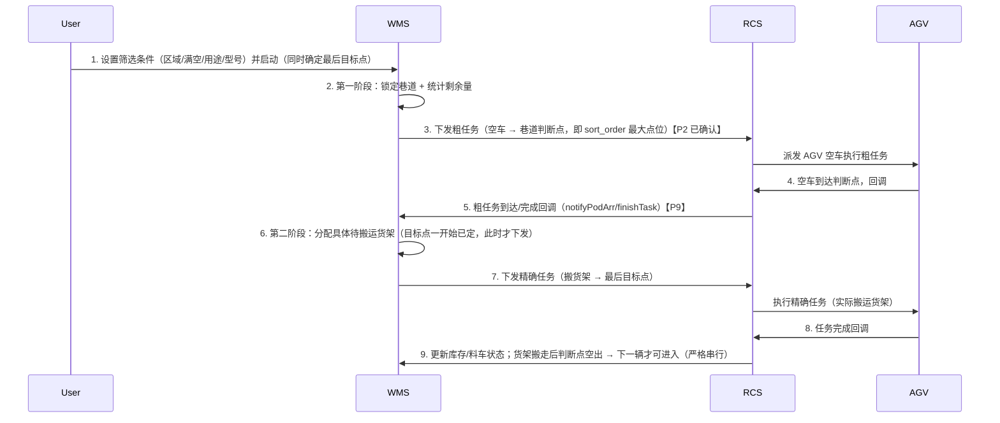

# WMS 满载料车智能调度与巷道锁定搬运方案（修订版 V1）

> **修订说明**：本文档基于《任务编排方案.md》原稿，对照 `wms/sql/public.sql` 实测库结构逐条核验后修订。
> 所有待确认/待修正问题以 **【P1】～【P16】** 编号标注，汇总见「〇、问题清单」，
> 建议按编号逐条解决，解决后在清单中更新状态。

---

## 〇、问题清单（解决跟踪表）

| 编号 | 类别 | 问题 | 影响 | 建议方案 | 状态 |
|------|------|------|------|----------|------|
| 【P1】 | 硬伤 | 已派发料车未从候选集排除，`remaining=0` 时 SQL 仍返回行 | 同一辆车被反复下发 | 候选集加 `NOT EXISTS` 排除在途任务；`remaining_pending` 改为"候选数"（已落地 4.2/4.3 SQL） | ✅ 已解决（NOT EXISTS 防重复 + 候选数口径） |
| 【P2】 | 硬伤 | 阶段二固定查 `sort_order 最大` 尾端，同巷道多辆在途时全部指向同一点 | 多 AGV 抢同一尾端点位，撞点 | **已确认方案B（串行）**：判断点 = 巷道内 `sort_order` 最大点位地标码（固定、与货架有无无关）；同巷道严格串行（在途数 ≤1）——`wms_rcs_task` 加 `aisle_id` 字段，按巷道统计在途任务数，货架搬走、判断点空出后才允许下一辆进入 | ✅ 已确认（方案B 串行 + 判断点 max sort_order + aisle_id 统计） |
| 【P3】 | 硬伤 | `Cart` 实体没有 `locationId`（只有 `area` 字符串），原手动插队 `cart.getLocationId()` 编译不过 | 手动插队接口无法实现 | 区域校验走 `wms_cart_inventory.location_id`，用 IService 自带 `getOne(LambdaQueryWrapper)` 一行实现，无需新增接口方法（已落地 5.4） | ✅ 已解决（getOne 查库存表区域） |
| 【P4】 | 硬伤 | `@Scheduled` 定时线程没有用户会话，原 `getCurrentFilter()` 从 SecurityContext 取不到筛选条件 | 调度器跑不起来 | 筛选条件持久化到 `wms_dispatch_session` 表，前端"启动/停止"写 running 状态，调度器从 DB 读（已落地 5.1，不依赖用户会话） | ✅ 已解决（筛选条件持久化 5.1） |
| 【P5】 | 业务确认 | 空车（EMPTY）终点逻辑：原方案满/空两阶段都进巷道尾端 | 空车是否也该搬进巷道尾部存放置疑 | **已明确**：空车模式粗任务同样为空车到判断点；精确任务把空车搬到目标储位（最后目标点一开始确定、实际搬运时才下发） | ✅ 已明确（空车粗任务到判断点 + 精确任务搬到目标储位） |
| 【P6】 | 业务确认 | 部分装载车（`status=2`，1~容量-1 件）永远不参与调度 | 中间状态车不被搬运 | **已确认**：仅搬运满/空车，部分装载车（`status=2`）由人工搬运，不参与自动调度 | ✅ 已确认（仅满/空参与调度） |
| 【P7】 | 边界 | 满车判断 `quantity = COALESCE(actual_capacity, max_capacity)` 严格相等；`current_quantity`/`actual_capacity` 可空，NULL 比较恒不成立 | 满车漏判/永不选中 | 以 `status=3` 为主判据 + 容量侧双重 `COALESCE(...,0)` 兜底（已落地 2.1/4.2/4.3 SQL） | ✅ 已解决（status 主判据 + 容量侧双重 COALESCE） |
| 【P8】 | 衔接 | 两阶段是两条 RCS 任务，原任务模型无阶段标识 | 回调回来状态/库存更新串线 | `wms_rcs_task` 加 `task_stage`（`ROUTING` 粗 / `PRECISE` 精确），与 `aisle_id` 同批 DDL；**双保险**：粗/精任务配置不同回调 URL 作第一道防线，`task_stage` 字段服务列表展示/手动操作/统计兜底 | ✅ 已解决（task_stage 字段 + 回调 URL 区分双保险） |
| 【P9】 | 衔接 | 阶段二触发时机原用"AGV 到达"事件，现有 `notifyRobotArr` 映射的是执行中 | 触发时机不准 | **触发信号由 RCS 管控，收到即触发**：粗任务完成信号（`finishTask` 等 FINISHED 回调）表示空车已到位 → 触发第二阶段分配货架；`notifyRobotArr`（执行中/途经点）不触发 | ✅ 已解决（以粗任务 FINISHED 回调触发，信号由 RCS 管控） |
| 【P10】 | 衔接 | 限流统计依赖任务状态（0/1/2），任务取消/异常时统计会虚高 | 巷道剩余量不准、巷道锁不释放 | **口径统一**：在途=`status IN (0,1,2)`，终态（3/4/5）一律不计入；任务终态时刷新 Redis 剩余量缓存并重新评估巷道锁；待执行(0)超时兜底置异常(5)，防料车永久排除 | ✅ 已解决（口径统一 + 终态缓存刷新 + 0 超时兜底） |
| 【P11】 | 衔接 | 原精确任务 `submitPreciseTask(agvCode,...)` 与现有下发 API 口径不一致 | 无法直接复用现有提交逻辑 | **不新增方法**：精确任务 = `task_stage='PRECISE'` 的普通搬运任务，复用现有 `saveRcsTask(dto) + submitRcsTask(id)` 链路（from=判断点、to=最后目标点、cartCode=货架、taskType=1、agvCode 不传，RCS 分配），已落地 5.5 | ✅ 已解决（复用现有建单+下发链路） |
| 【P12】 | 基建 | 需要 `@Scheduled`、锁/缓存 | 调度器无法启用 | **零改动，已具备**：`@EnableScheduling` 已开启（WmsApplication L13）；`RedisTemplate<String,Object>` 项目已有 15+ 处使用；`@Scheduled` 定时任务已有先例（CartStatusSyncTask 等），调度器照 5.3 编写即可 | ✅ 已解决（基建已具备，无需改动） |
| 【P13】 | DDL 确认 | `wms_point.aisle_id` 可空（离散点位直挂区域），内连接自动排除 | 离散点位的料车永不参与调度 | **已确认：离散点位需要调度但本期不做（V2 预留）**。本期仅巷道点位（JOIN wms_aisle 内连接自动排除离散）；V2 加"点位归属"维度（DISCRETE → `LEFT JOIN wms_aisle` + `aisle_id IS NULL` 分支，单段搬运、无判断点/串行） | ✅ 已确认（离散 V2 预留，本期仅巷道） |
| 【P14】 | DDL 确认 | `wms_location` 是多级树（`parent_id`），原筛选只精确匹配一个区域 | 选父区域不包含子区域料车 | **已确认：不考虑父子递归**——料车默认都入父区（`wms_cart_inventory.location_id` 即为父区），筛选精确匹配一个区域即可，`ci.location_id = #{locationId}` 保持不变（4.2） | ✅ 已确认（不递归，料车默认挂父区） |
| 【P15】 | DDL 衔接 | `wms_rcs_task.from_location/to_location` 存 `point_code`（varchar），RCS 下发认地标码（coordinate） | 存储口径与 RCS 不一致，下发需转换 | **已确认：维持现状不改**——任务表继续存 `point_code`，下发经 `toRcsSiteCode` 转 coordinate（现有链路已验证可用）；监听器保持按 point_code 反查。任务表直接存地标码作为后续优化项，如需落地须三处联动（建单转存/下发免转换/监听器改按 coordinate 反查） | ✅ 已解决（维持 point_code 口径 + 下发转换） |
| 【P16】 | DDL 确认 | 库存表有 `arrive_quantity`（落位时装载量快照），与实时 `current_quantity` 两套口径 | 满/空判断口径不一致 | **已确认：`arrive_quantity` 随存/取货同步更新**（绑定/落位时写当时装载量快照，之后每次存/取货同步到与 `current_quantity` 一致），与实时量口径一致、不构成两套口径；满/空判断主判据 `c.status`（存/取货自动更新 1/2/3）+ 实时 `current_quantity` 校验，见 2.1 | ✅ 已解决（arrive_quantity 随存/取货同步，判断走 status + 实时量） |

---

## 一、方案背景与目标

### 1.1 业务背景
陶瓷/制造行业 WMS：满载/空载料车需由 AGV 搬运至指定位置。系统需在**用户自定义筛选**与**人工干预**两种模式下高效、有序完成搬运。

### 1.2 核心目标
1. **用户自定义筛选**：按区域、料车状态（满/空）、巷道用途、货架型号多维筛选。
2. **巷道锁定连续搬运**：选中某巷道后锁定，持续处理其中符合条件的料车，直到无可派发料车才释放锁重新筛选。
3. **两阶段动态调度**：
   - 第一阶段（粗任务·空车）：筛选并锁定巷道，下发**粗任务**——**空车** AGV 行驶到该巷道**判断点**（巷道内 `sort_order` 最大点位的地标码，固定点位、与货架有无无关）。
   - 第二阶段（精确任务·搬货架）：AGV 空车到达判断点回传后，分配**具体待搬运货架**并下发**精确任务**——把货架搬到**最后目标点**。最后目标点在计划开始时即确定，但只有到实际搬运货架（下发精确任务）时才传给 RCS。
4. **动态限流防拥堵**：按巷道"剩余可派发料车数"控制向同一巷道派发量（口径见 P1/P10）。
5. **人工插队干预**：用户手动指定料车最高优先级，执行后自动转入该巷道锁定模式。

### 1.3 两阶段调度流程图



---

## 二、用户筛选维度

| 筛选维度 | 是否必填 | 说明 |
|---------|---------|------|
| **区域**（`locationId`） | ✅ 是 | 业务操作范围（精确匹配，不递归子区域，P14 已确认） |
| **料车状态**（`loadType`） | ✅ 是 | `FULL`（满车）或 `EMPTY`（空车） |
| **巷道用途**（`aislePurpose`） | ❌ 否 | `FULL` / `MIXED` / `EMPTY` |
| **货架型号**（`modelCode`） | ❌ 否 | 对应 `wms_aisle.model_code` |
| **点位归属**（`pointType`） | ❌ 否 | `AISLE` 巷道（本期默认）/ `DISCRETE` 离散（V2 预留，本期不实现） |

### 2.1 满车/空车判断逻辑（P7 修正）

| 场景 | 判断条件（建议） |
|------|----------|
| **满车（FULL）** | `c.status = 3`（主判据，不可为 NULL）且 `COALESCE(c.current_quantity,0) = COALESCE(c.actual_capacity, cm.max_capacity, 0)` |
| **空车（EMPTY）** | `c.status = 1` 且 `COALESCE(c.current_quantity,0) = 0` |

> 【P7】`current_quantity`/`actual_capacity` 均可空，判断必须 `COALESCE` 兜底；建议以 `status` 为主判据，数量校验放宽容差。
> 【P16】**已解决**：`arrive_quantity` 随存/取货同步更新——绑定/落位时写当时装载量快照，之后每次存/取货同步，与 `wms_cart.current_quantity` 口径一致（不存在两套口径之争）；满/空判断主判据 `c.status`（存/取货自动更新 1 空闲/2 使用中/3 满载）+ 实时 `current_quantity` 校验，见上表。
> 【P6】部分装载车（`status=2`，1~容量-1 件）不参与自动调度，由人工搬运；SQL 中 `FULL/EMPTY` 分支即按此口径，无需放行中间状态。

---

## 三、核心业务规则

### 3.1 料车排序规则（第一阶段）
| 优先级 | 排序字段 | 规则 |
|--------|----------|------|
| 1 | `ci.arrive_time` | 越早落位越优先（先进先出） |
| 2 | `p.sort_order` | 数字越小越优先 |

### 3.2 巷道锁定规则
- 选中一辆料车后，立即锁定其所在巷道；锁存 Redis（key：`wms:locked_aisle:{locationId}`，TTL 300s）。
- 锁释放前只从该巷道取车；巷道内无任何候选料车时释放锁。
- 每次派发任务后刷新 TTL 防死锁。
- **同巷道严格串行（P2 已确认）**：同一巷道在途任务数 ≤1。判断点（`sort_order` 最大点位）同时也是储位，货架未搬走前下一辆空车不得下发粗任务；货架搬走、判断点空出后才允许下一辆进入。

### 3.3 剩余可派发数量（P1 修正）
```
remaining_pending = 该巷道候选料车数（已排除在途）
```
> 【P1】原公式 `total - assigned` 不排除"已有在途任务的料车"本身仍可被选中，会重复派发。修订为：候选集直接排除在途任务料车，剩余量即候选数。

### 3.4 巷道锁定/解锁决策表
| 当前状态 | 查询结果 | 行为 |
|---------|---------|------|
| 无锁定 | 有结果 | 锁定新巷道，派发粗任务 |
| 无锁定 | 无结果 | 等待（全局无车） |
| 有锁定 | 有结果（同巷道） | 继续锁定，派发 |
| 有锁定 | 有结果（不同巷道） | 释放原锁，锁定新巷道 |
| 有锁定 | 无结果 | 释放锁（候选已清空） |

### 3.5 人工插队规则（P3 修正）
- 手动指定料车最高优先级，忽略当前巷道锁。
- 选中后锁定其所在巷道，转入巷道锁定连续搬运模式。
- **区域校验必须走 `wms_cart_inventory.location_id`**（`wms_cart` 无 location_id 字段）。

---

## 四、核心 SQL 设计（修订版）

### 4.1 参数说明

| 参数名 | 类型 | 含义 |
|--------|------|------|
| `#{locationId}` | BIGINT | 区域ID（必填，精确匹配不递归，P14 已确认） |
| `#{loadType}` | VARCHAR | `FULL` / `EMPTY` |
| `#{aislePurpose}` | VARCHAR | 可选 |
| `#{modelCode}` | VARCHAR | 可选 |
| `#{lockedAisleId}` | BIGINT | 当前锁定巷道ID（无锁 NULL） |
| `#{manualCartId}` | BIGINT | 手动指定料车ID（无 NULL） |
| `#{pointType}` | VARCHAR | 点位归属：`AISLE` 巷道（本期）/ `DISCRETE` 离散（V2 预留，本期仅 AISLE） |

### 4.2 第一阶段 SQL（筛选 + 锁定巷道 + 剩余量 + 判断点）

```sql
WITH qualified_carts AS (
    SELECT
        ci.cart_id,
        c.cart_code,
        ci.point_id,
        ci.arrive_time,
        ci.aisle_id,
        ci.location_id,
        a.aisle_code,
        a.aisle_purpose
    FROM wms_cart_inventory ci
    JOIN wms_cart        c  ON ci.cart_id = c.id
    JOIN wms_cart_model  cm ON c.model_id = cm.id
    JOIN wms_point       p  ON ci.point_id = p.id
    JOIN wms_aisle       a  ON p.aisle_id = a.id    -- P13：内连接=仅巷道点位（本期）；离散点位(V2)改 LEFT JOIN + aisle_id IS NULL 分支
    WHERE ci.cart_id IS NOT NULL
      AND ci.lock_status = 0
      AND p.status = 1
      AND a.status = 1
      AND ci.location_id = #{locationId}          -- P14：已确认不递归，料车默认挂父区，精确匹配
      AND (
            ( #{loadType} = 'FULL'
              AND c.status = 3
              AND COALESCE(c.current_quantity, 0) = COALESCE(c.actual_capacity, cm.max_capacity, 0) )
            OR
            ( #{loadType} = 'EMPTY'
              AND c.status = 1
              AND COALESCE(c.current_quantity, 0) = 0 )
          )
      AND ( #{aislePurpose} IS NULL OR a.aisle_purpose = #{aislePurpose} )
      AND ( #{modelCode}    IS NULL OR a.model_code    = #{modelCode} )
      AND NOT EXISTS (                             -- P1：排除在途任务料车，防重复派发
            SELECT 1 FROM wms_rcs_task t
            WHERE t.cart_code = c.cart_code
              AND t.status IN (0, 1, 2) )
      AND (                                        -- 三种调度模式
            ( #{manualCartId} IS NOT NULL AND ci.cart_id = #{manualCartId} )
            OR
            ( #{manualCartId} IS NULL AND #{lockedAisleId} IS NOT NULL AND ci.aisle_id = #{lockedAisleId} )
            OR
            ( #{manualCartId} IS NULL AND #{lockedAisleId} IS NULL )
          )
),
selected_cart AS (
    SELECT q.*,
           COUNT(*) OVER (PARTITION BY q.aisle_id) AS remaining_pending,  -- 候选数即剩余可派数（P1）
           (SELECT COUNT(*) FROM wms_rcs_task t2                     -- P2：巷道在途任务数（严格串行）
             WHERE t2.aisle_id = q.aisle_id
               AND t2.status IN (0, 1, 2)) AS aisle_in_flight,
           ROW_NUMBER() OVER (
               ORDER BY
                 CASE WHEN #{manualCartId}   IS NOT NULL THEN 0 ELSE 1 END,
                 CASE WHEN #{lockedAisleId}  IS NOT NULL THEN 0 ELSE 1 END,
                 q.arrive_time ASC,
                 p.sort_order ASC
           ) AS rn
    FROM qualified_carts q
    JOIN wms_point p ON q.point_id = p.id
)
SELECT sc.cart_id,
       sc.cart_code,
       sc.point_id    AS current_point_id,
       sc.arrive_time,
       sc.aisle_id,
       sc.aisle_code,
       sc.aisle_purpose,
       sc.remaining_pending,
       sc.aisle_in_flight,
       dp.id          AS decision_point_id,
       dp.point_code  AS decision_point_code
FROM selected_cart sc
LEFT JOIN wms_point dp
       ON dp.aisle_id = sc.aisle_id
      AND dp.status = 1
      AND dp.sort_order = (
            SELECT MAX(e.sort_order) FROM wms_point e
            WHERE e.aisle_id = sc.aisle_id AND e.status = 1 )
WHERE sc.rn = 1
  AND sc.aisle_in_flight = 0                -- P2：严格串行，巷道在途任务数为 0 才派发
LIMIT 1;
```

> **4.2 说明（按用户最新澄清，P2 已确认）**：
> - 粗任务是**空车**任务：空车 AGV 行驶到巷道**判断点**（`sort_order` 最大点位，固定、与货架有无无关）。
> - 判断点同时也是储位：货架未搬走前，下一辆空车不得进入（同巷道严格串行，见 3.2）。
> - **最后目标点**在计划开始时即确定并随调度会话保存，但仅在第二阶段精确任务（实际搬运货架）时才下发给 RCS，粗任务不携带目标点。
> - 粗任务无料车载荷（空车移动），提交时 `cartCode` 可为空；需确认复用 `AGV_submitTask`（SUB_TASK）作为空车移动接口。
> - **串行落地（P2）**：`wms_rcs_task` 新增 `aisle_id` 字段（与 `task_stage` 同批 DDL），粗/精确任务创建时写入所属巷道；`aisle_in_flight` 按 `aisle_id + status IN (0,1,2)` 统计，空车粗任务（cart_code 为 NULL）也能被统计到，`>0` 时禁止派发下一辆。

### 4.3 第二阶段 SQL（空车到达判断点后 → 分配具体待搬运货架，P2 已确认）

```sql
-- 从判断点向里取待搬运货架（sort_order 大的优先，离判断点近）
SELECT
    c.id            AS cart_id,
    c.cart_code,
    c.status,
    ci.point_id     AS shelf_point_id,
    ci.point_code   AS shelf_point_code,
    p.sort_order    AS shelf_sort_order,
    ci.arrive_time
FROM wms_cart_inventory ci
JOIN wms_cart       c  ON ci.cart_id = c.id
JOIN wms_cart_model cm ON c.model_id = cm.id
JOIN wms_point      p  ON ci.point_id = p.id
WHERE ci.aisle_id = #{aisleId}               -- 从粗任务回调中取
  AND ci.cart_id IS NOT NULL
  AND ci.lock_status = 0
  AND p.status = 1
  AND (
        ( #{loadType} = 'FULL'
          AND c.status = 3
          AND COALESCE(c.current_quantity,0) = COALESCE(c.actual_capacity, cm.max_capacity, 0) )
        OR
        ( #{loadType} = 'EMPTY'
          AND c.status = 1
          AND COALESCE(c.current_quantity,0) = 0 )
      )
  AND NOT EXISTS (                           -- P1：排除在途任务货架
        SELECT 1 FROM wms_rcs_task t
        WHERE t.cart_code = c.cart_code
          AND t.status IN (0, 1, 2) )
ORDER BY p.sort_order DESC
LIMIT 1;
-- 最后目标点（#{targetPointCode}）：计划开始时已确定并随调度会话保存，
-- 仅在第二阶段下发精确任务（实际搬运货架）时才传给 RCS。
```

> 【P2 已确认】判断点 = 巷道内 `sort_order` 最大的点位地标码（固定、与货架有无无关）。
> 第二阶段**不再查"最深空位"**，而是从判断点分配**具体待搬运货架**；最后目标点一开始就确定，等 AGV 实际搬运货架（下发精确任务）时才给出。
> 同巷道严格串行（在途数 ≤1）：货架搬走、判断点空出后，下一辆空车才下发粗任务进入。

---

## 五、应用层调度逻辑（P4/P3 修正）

### 5.1 筛选条件持久化（P4）

```sql
CREATE TABLE wms_dispatch_session (
    id               int8 PRIMARY KEY,          -- 雪花ID
    location_id      int8 NOT NULL,             -- 区域
    load_type        varchar(10) NOT NULL,      -- FULL / EMPTY
    aisle_purpose    varchar(20),
    model_code       varchar(20),
    point_type       varchar(10) DEFAULT 'AISLE',    -- 点位归属：AISLE 巷道（本期）/ DISCRETE 离散（V2 预留，P13）
    target_point_code varchar(50),              -- 最后目标点（计划开始时确定，精确任务才下发 RCS）
    running          int2 DEFAULT 0,            -- 0停止 1运行
    created_by       int8,
    created_time     timestamp DEFAULT CURRENT_TIMESTAMP,
    updated_time     timestamp DEFAULT CURRENT_TIMESTAMP
);
```

- 前端"启动调度"时写一条会话（含筛选条件），调度器定时循环读该会话执行；"停止"则置 `running=0`。
- 调度线程不再依赖用户会话（解决 P4）。

### 5.2 锁管理（Redis）

| Key | Value | TTL | 说明 |
|-----|-------|-----|------|
| `wms:locked_aisle:{locationId}` | 巷道ID | 300s | 当前区域锁定巷道，每次派发刷新 |
| `wms:aisle:remaining:{locationId}` | 剩余数 | 300s | 前端展示进度 |

直接用现有 `RedisTemplate`（P12），无需额外 CacheManager 配置。

- **终态刷新（P10）**：任务到终态（3 完成/4 取消/5 异常）时，刷新该巷道剩余量缓存，并触发调度器重新评估巷道锁（[3.4 决策表](#34-巷道锁定解锁决策表) 会自动释放/切换）。

### 5.3 调度循环（伪代码）

```java
@Component
public class CartDispatchScheduler {
    @Scheduled(fixedDelay = 2000)             // P12：需 @EnableScheduling
    public void dispatchLoop() {
        // 1. 读取运行中的调度会话（P4）
        List<DispatchSession> sessions = dispatchSessionMapper.selectRunning();
        for (DispatchSession s : sessions) {
            Long lockedAisleId = lockManager.getLockedAisleId(s.getLocationId());
            Long manualCartId  = manualCartQueue.pollPending(s.getLocationId());
            DispatchResult r = dispatchMapper.selectOptimalCart(
                s.getLocationId(), s.getLoadType(), s.getAislePurpose(),
                s.getModelCode(), lockedAisleId, manualCartId);
            if (r == null) {
                if (lockedAisleId != null) lockManager.unlockAisle(s.getLocationId());
                continue;
            }
            // P2 严格串行（双保险）：4.2 SQL 已带 aisle_in_flight = 0，此处再防御一次
            if (rcsTaskService.countInFlightByAisle(r.getAisleId()) >= 1) continue;
            // 巷道切换/首次锁定 + 刷新TTL + 缓存剩余量
            if (!r.getAisleId().equals(lockedAisleId)) lockManager.lockAisle(s.getLocationId(), r.getAisleId());
            lockManager.refreshTTL(s.getLocationId());
            // 下发粗任务（空车 → 判断点）：目标点已确定但暂不下发给 RCS（P2）
            rcsTaskService.submitRoutingTask(r, s.getLoadType(), s.getTargetPointCode());
        }
    }
}
```

### 5.4 手动插队接口（P3 已解决）

```java
@PostMapping("/manual/{cartId}")
public Result<Void> manualDispatch(@PathVariable Long cartId, @RequestParam Long locationId) {
    // 区域校验：走库存表点位冗余的 location_id（wms_cart 只有 area 字符串，不可用）。
    // 用 IService 自带 getOne 实现，无需新增接口方法（P3）
    CartInventory inv = cartInventoryService.getOne(
            new LambdaQueryWrapper<CartInventory>().eq(CartInventory::getCartId, cartId));
    if (inv == null || !Objects.equals(inv.getLocationId(), locationId)) {
        return Result.failed("料车不在该区域或未入库");
    }
    // 前置校验：料车状态可搬运（非维修、非在途）→ 入插队队列
    manualCartQueue.pushPending(locationId, cartId);
    return Result.success();
}
```

> **备注（方案 C）**：接口层区域校验是"即时反馈"的体验优化；即使漏校验，4.2 SQL 的 `ci.location_id = #{locationId}` 也会在调度层兜底（插队无效 → 清标记 → 继续原调度）。

### 5.5 第二阶段触发（空车到达判断点回调，P2/P9）

```java
// 回调处理（粗任务 FINISHED 信号 → 触发第二阶段；信号由 RCS 管控，P9）
public void onRoutingArrived(String taskCode) {
    RcsTask routing = rcsTaskMapper.selectByTaskCode(taskCode);
    if (!"ROUTING".equals(routing.getTaskStage())) return;      // P8：只处理粗任务

    // 1. 分配具体待搬运货架（4.3 SQL，从判断点向里取）
    ShelfCandidate shelf = dispatchMapper.selectShelfAtDecisionPoint(
        routing.getAisleId(), routing.getLoadType());
    if (shelf == null) {
        lockManager.unlockAisle(routing.getLocationId());       // 巷道无可搬运货架 → 释放锁
        return;
    }

    // 2. 下发精确任务：复用现有 saveRcsTask + submitRcsTask 链路（P11）
    //    精确任务 = task_stage='PRECISE' 的普通搬运任务，agvCode 不传（RCS 分配）
    RcsTaskDTO dto = new RcsTaskDTO();
    dto.setTaskType(1);                              // 搬运
    dto.setCartCode(shelf.getCartCode());            // 货架
    dto.setFromLocation(routing.getToLocation());    // 起点=判断点（粗任务终点，point_code）
    dto.setToLocation(routing.getTargetPointCode()); // 终点=最后目标点（point_code，计划开始已确定，此时才下发）
    // task_stage='PRECISE'、aisle_id 在建单逻辑内写入（P8/P2）
    Long preciseId = rcsTaskService.saveRcsTask(dto);
    rcsTaskService.submitRcsTask(preciseId);
}
```

---

## 六、与现有系统的衔接（P8/P9/P10/P11/P15）

| 衔接点 | 处理方式 |
|--------|----------|
| 【P2】判断点与串行 | 判断点 = 巷道内 `sort_order` 最大点位地标码（固定）；同巷道在途数 ≤1，货架搬走、判断点空出后才下发下一辆粗任务 |
| 任务携带巷道（P2 落地） | `wms_rcs_task` 加 `aisle_id`（与 `task_stage` 同批 DDL）；粗/精确任务创建时写入所属巷道；串行与限流统一按 `aisle_id + status IN (0,1,2)` 统计（覆盖空车任务 cart_code 为 NULL 的场景） |
| 【P8】两阶段任务标识 | `wms_rcs_task` 加 `task_stage`（`ROUTING` 粗 / `PRECISE` 精确），与 `aisle_id` 同批 DDL；创建任务时写入阶段标识。**双保险**：粗/精任务配置不同回调 URL（第一道防线），回调处理再按 `task_stage` 二次确认（列表展示/手动操作/统计兜底） |
| 【P9】阶段二触发时机 | 触发信号由 RCS 管控，收到即触发：粗任务 FINISHED 回调（`finishTask`，现有已映射 完成）表示空车到判断点 → 触发第二阶段；`notifyRobotArr`（映射执行中/途经点）不触发 |
| 【P10】任务终态与限流一致 | 统一口径：在途=`status IN (0,1,2)`，终态（3/4/5）一律不计入；任务到终态时刷新 `wms:aisle:remaining` 缓存并重新评估巷道锁；待执行(0)超时兜底置 5 异常，防料车永久排除 |
| 【P11】精确任务接口参数 | 不新增 `submitPreciseTask(agvCode,...)`：精确任务 = `task_stage='PRECISE'` 的普通搬运任务，复用现有 `saveRcsTask(dto) + submitRcsTask(id)` 链路，`from=判断点`、`to=最后目标点`、`cartCode=货架`，`agvCode` 不传（RCS 分配，现有 buildSubmitParams 本就不含 agvCode） |
| 【P15】地标码口径 | 任务表 `from_location/to_location` 直接存地标码（`wms_point.coordinate`，即 RCS 站点码），下发 `targetRoute.code` 免转换（toRcsSiteCode 简化）；库存联动监听器（RcsInventoryEventListener）由 `selectPointIdByPointCode` 改为 `selectPointIdByCoordinate` 反查点位；5.5 第二阶段 `from=判断点地标码`、`to=目标点地标码` |
| 【P16】arrive_quantity 同步落地 | 绑定/落位时（bind/preBind/syncExternalBind）在 `wms_cart_inventory.arrive_quantity` 写当时 `current_quantity` 快照；存/取货后（现有 `updateCartAfterChange`）同步该车所在点位的 `arrive_quantity`，保持与 `current_quantity` 一致 |
| 库存联动 | 沿用现有回调驱动：粗任务完成 → 空车落判断点；精确任务完成 → 货架落最后目标点（`syncExternalBind` 本地镜像） |
| 粗任务空车提交 | 空车移动无料车载荷，`cartCode` 可为空；确认复用 `AGV_submitTask`（SUB_TASK）作为空车移动接口，参数口径与现有 submitRcsTask 一致 |

---

## 七、边界场景与容错

| 场景 | 处理 |
|------|------|
| 锁定巷道全部在途 | 下一轮候选为空（P1 已排除在途）→ 释放锁 → 全局择优 |
| 锁定期间新满车进入巷道 | 自动纳入候选（锁定模式限定 `aisle_id`） |
| 粗任务下发失败 | 重试 2 次 → 标记料车异常 → 释放锁避免阻塞 |
| 死锁兜底 | Redis TTL 300s，派发后刷新；崩溃后自动过期恢复全局筛选 |
| 手动插队无效料车 | 查询返回空 → 清插队标记 → 继续原调度 |
| 判断点储位被占（货架未搬走） | 串行等待：该巷道在途数=1，不下发新粗任务；货架搬走、判断点空出后再派下一辆（3.2） |
| 到达回调丢失/超时 | 粗任务下发 60s 未收到到达回调 → 主动查 RCS 状态或告警（P9 相关） |
| 待执行(0)卡死 | 任务创建后超时仍为 0（下发失败/重试无效）→ 置异常(5)，释放料车占用，防永久排除（P10） |
| 巷道只有 1 个点位（判断点=唯一储位） | 粗任务直接到位，按现场流程决定是否跳过第二阶段 |
| 巷道无待搬运货架（分配结果为空） | 释放巷道锁，回到全局筛选 |

---

## 八、性能优化建议

```sql
-- 第一阶段：区域+巷道+锁定+落位时间排序（候选集以库存为主表）
CREATE INDEX CONCURRENTLY idx_inventory_dispatch_opt
ON wms_cart_inventory (location_id, aisle_id, lock_status, arrive_time)
WHERE cart_id IS NOT NULL;

-- 判断点查询（sort_order 最大）
CREATE INDEX CONCURRENTLY idx_point_aisle_status_sort
ON wms_point (aisle_id, status, sort_order DESC);

-- 在途任务统计：按料车编码查活跃任务
CREATE INDEX CONCURRENTLY idx_rcs_task_cart_status
ON wms_rcs_task (cart_code, status);

-- 巷道在途任务统计（P2 严格串行 + P10 限流口径）
CREATE INDEX CONCURRENTLY idx_rcs_task_aisle_status
ON wms_rcs_task (aisle_id, status);
```

---

## 九、可选：巷道锁定操作日志表

```sql
DROP TABLE IF EXISTS "public"."wms_aisle_lock_log";
CREATE TABLE "public"."wms_aisle_lock_log" (
    "id"             BIGSERIAL PRIMARY KEY,
    "location_id"    BIGINT NOT NULL,
    "aisle_id"       BIGINT NOT NULL,
    "operation"      VARCHAR(10) NOT NULL,      -- LOCK / UNLOCK
    "trigger_cart_id" BIGINT,
    "operator_type"  VARCHAR(10) NOT NULL,      -- SYSTEM / MANUAL
    "operator_id"    BIGINT,
    "remark"         VARCHAR(255),
    "created_time"   TIMESTAMP DEFAULT CURRENT_TIMESTAMP
);
COMMENT ON TABLE "public"."wms_aisle_lock_log" IS '巷道锁定操作记录表（仅审计，不参与调度）';
```

---

## 十、方案总结

| 模块 | 要点 |
|------|------|
| 用户筛选 | 区域/满空/巷道用途/货架型号四维 + 点位归属（本期仅巷道，离散 V2 预留 P13） |
| 两阶段调度 | 粗任务=空车到判断点（`sort_order` 最大、严格串行）+ 到达后分配货架精确搬运到最后目标点（P2/P9 已确认） |
| SQL | 统一查询支持全局/锁定/插队三模式，`NOT EXISTS` 防重复派发（P1） |
| 限流 | 候选集即剩余量，口径与任务状态机一致（P1/P10） |
| 状态管理 | Redis 锁 + TTL 300s 兜底（P12 已具备，复用现有 RedisTemplate） |
| 人工干预 | 插队队列最高优先级，区域校验走库存表（P3 已解决） |
| 衔接 | 任务阶段标识 + 回调触发 + 参数口径统一（P8/P9/P11/P15） |
