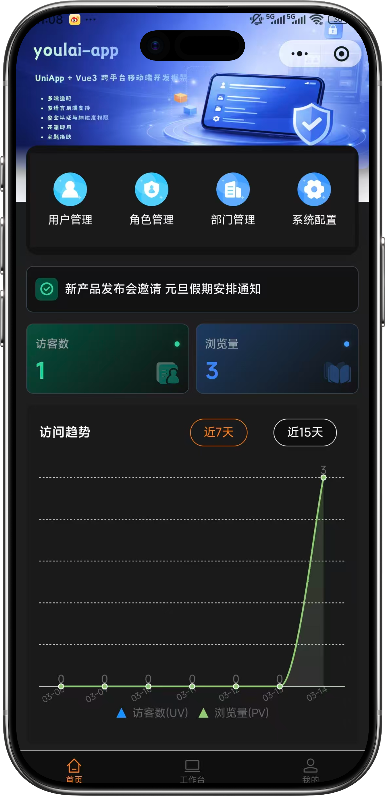
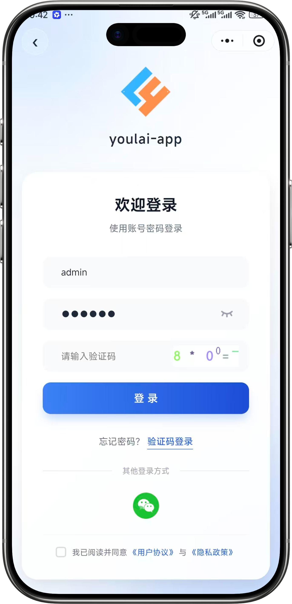
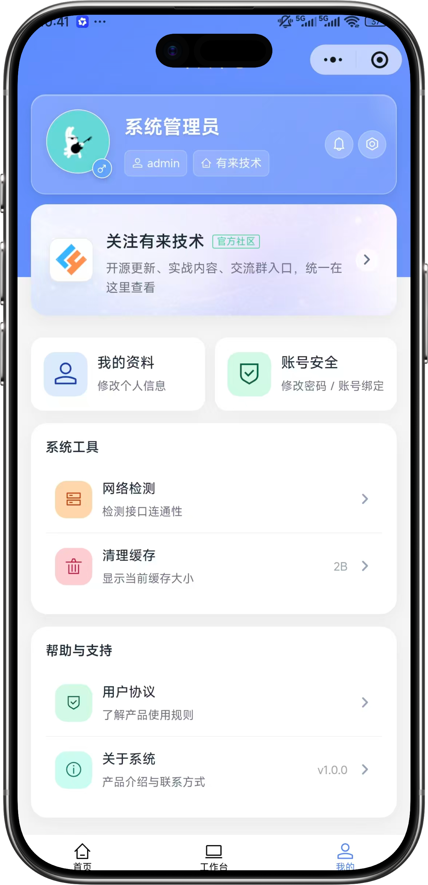

<div align="center">

#  youlai-boot

[English](./README.en.md) · [简体中文](./README.md)

**Enterprise-grade permission management backend based on Spring Boot 4**

[](https://spring.io/projects/spring-boot)
[](https://openjdk.org/)
[](LICENSE)
[](https://gitee.com/youlaiorg/youlai-boot/stargazers)
[](https://github.com/youlaitech/youlai-boot)
[](https://gitcode.com/youlai/youlai-boot/stargazers)

</div>


<div align="center">

[🖥️ Live Preview](https://vue.youlai.tech) | [📱 Mobile Preview](https://app.youlai.tech) | [📖 Documentation](https://www.youlai.tech/docs/server/spring-boot/)

</div>

## Introduction

**youlai-boot** is an enterprise-grade permission management backend built on Spring Boot 4. It ships with the frontend [vue3-element-admin](https://gitee.com/youlaiorg/vue3-element-admin) and the mobile app [youlai-app](https://gitee.com/youlaiorg/youlai-app), and is one of **7 language implementations** (Java / Node.js / Go / Python / PHP / C# / Rust) that share the same API specification and database schema. It is suitable for learning, reference, and secondary development of enterprise admin systems.

## Core Features

- 🔐 **Security** — Spring Security + JWT/Redis dual-session model, token renewal, multi-device mutual exclusion
- 🛡️ **Fine-grained permissions** — 5-level RBAC: data → menu → button → API → field
- ⚡ **Code generator** — one-click generation of full-stack CRUD code
- 📦 **Complete modules** — users, roles, menus, departments, dictionaries, files, scheduled tasks, message center, operation logs
- 🌐 **Multi-tenant SaaS** — data isolation + tenant config, with a standalone [youlai-boot-tenant](https://gitee.com/youlaiorg/youlai-boot-tenant) edition
- 🔌 **Real-time communication** — SSE push: online user count, dictionary sync, notification broadcast

## System Preview

**PC**

<table align="center">
  <tr>
    <td></td>
    <td></td>
  </tr>
  <tr>
    <td></td>
    <td></td>
  </tr>
  <tr>
    <td></td>
    <td></td>
  </tr>
</table>

**Mobile**

<table align="center">
  <tr>
    <td></td>
    <td></td>
    <td></td>
    <td></td>
  </tr>
</table>

## Quick Start

**Requirements**: JDK 17+ · MySQL 8.0+ · Redis 6.0+

1. Clone: `git clone https://gitee.com/youlaiorg/youlai-boot.git`
2. Import database: `sql/youlai-admin.sql`
3. Adjust config (optional, a read-only online data source is configured by default): `src/main/resources/application-dev.yml`
4. Start and visit http://localhost:8000/doc.html

Default credentials: `admin` / `123456`

Detailed guide: https://www.youlai.tech/docs/server/spring-boot/quick-start.html

## Tech Stack

| Tech | Version | Description |
|:-----|:--------|:------------|
| Spring Boot | 4.0.5 | Core framework |
| Spring Security | 6.x | Auth & authorization |
| MyBatis-Plus | 3.5.15 | ORM |
| Druid | 1.2.24 | Connection pool |
| Redis + Redisson | 6.0+ / 4.1.0 | Cache · Session · Distributed lock |
| Caffeine | 2.9.3 | Local cache |
| XXL-Job | 3.2.0 | Distributed scheduled tasks |
| Knife4j | 4.5.0 | API docs |
| MapStruct | 1.6.3 | Object mapping |
| MinIO | 8.5.10 | Object storage |

## Directory Structure

```
youlai-boot/
├── deploy/
│   └── docker/                      # Docker orchestration
├── docs/                            # Docs and image assets
├── sql/                             # Database init scripts
├── src/                             # Source code
│   ├── YouLaiBootApplication.java   # Bootstrap class
│   ├── auth/                        # Auth (login/logout/token)
│   ├── codegen/                     # Code generator
│   ├── common/                      # Common module (constants/enums/response)
│   ├── file/                        # File service (MinIO/local/OSS)
│   ├── framework/                   # Technical framework layer
│   │   ├── apidoc/                  # OpenAPI / Knife4j
│   │   ├── cache/                   # Redis / Caffeine cache
│   │   ├── captcha/                 # Graphic captcha
│   │   ├── integration/             # SMS / Email / WeChat
│   │   ├── job/                     # XXL-Job scheduled tasks
│   │   ├── mybatis/                 # MyBatis-Plus config
│   │   ├── security/                # Security / JWT / Token
│   │   └── web/                     # Global exception / CORS / rate limit
│   ├── message/                     # SSE push
│   └── system/                      # Business (user/role/menu/dept)
└── pom.xml                          # Maven dependency management
```

## Ecosystem

**Frontend**

| Project | Stack | Description |
|:-----|:------|:------------|
| [vue3-element-admin](https://gitee.com/youlaiorg/vue3-element-admin) | Vue 3 + Element Plus | PC admin frontend (recommended) |
| [youlai-app](https://gitee.com/youlaiorg/youlai-app) | Vue 3 + UniApp | Mobile App |

**Backend**

| Project | Stack | Description |
|:-----|:------|:------------|
| [youlai-nest](https://gitee.com/youlaiorg/youlai-nest) | NestJS + TypeORM | Node.js |
| [youlai-gin](https://gitee.com/youlaiorg/youlai-gin) | Go + Gorm | Go |
| [youlai-django](https://gitee.com/youlaiorg/youlai-django) | Django + DRF | Python |
| [youlai-fastapi](https://gitee.com/youlaiorg/youlai-fastapi) | FastAPI + SQLAlchemy | Python |
| [youlai-thinkphp](https://gitee.com/youlaiorg/youlai-thinkphp) | ThinkPHP 8 | PHP |
| [youlai-aspnet](https://gitee.com/youlaiorg/youlai-aspnet) | ASP.NET Core | C# |
| [youlai-rust](https://gitee.com/youlaiorg/youlai-rust) | Axum + SeaORM | Rust |

> **youlai-boot** also provides the following variants and branches: [Multi-Tenant](https://gitee.com/youlaiorg/youlai-boot-tenant) (Spring Boot 4) · [MyBatis-Flex](https://gitee.com/youlaiorg/youlai-boot-flex) (Spring Boot 4) · [Spring Boot 3](https://gitee.com/youlaiorg/youlai-boot/tree/spring-boot-3) · [PostgreSQL](https://gitee.com/youlaiorg/youlai-boot/tree/db-pg) · [Multi-Module](https://gitee.com/youlaiorg/youlai-boot/tree/multi-module)
>
> The seven backends share the same **RESTful API specification** and **database schema**, so the frontend can switch seamlessly.

## Documentation

| Resource | Link |
|:-----|:-----|
| 📖 Full docs site | [www.youlai.tech](https://www.youlai.tech/) |
| 🖥️ PC live preview | [vue.youlai.tech](https://vue.youlai.tech) |
| 📱 Mobile live preview | [app.youlai.tech](https://app.youlai.tech) |
| 🔗 Apifox API docs | [apifox.com](https://www.apifox.cn/apidoc/shared-195e783f-4d85-4235-a038-eec696de4ea5) |
| 🔗 Local API docs | [localhost:8000/doc.html](http://localhost:8000/doc.html) |

## License

Released under the [Apache License 2.0](LICENSE); free for commercial use.

---

<table align="center">
  <tr>
    <td align="center">
      <br>
      <sub>Official WeChat Account</sub>
    </td>
    <td>&nbsp;&nbsp;&nbsp;&nbsp;</td>
    <td align="center">
      <br>
      <sub>Mini Program</sub>
    </td>
    <td>&nbsp;&nbsp;&nbsp;&nbsp;</td>
    <td align="center">
      <br>
      <sub>Add author on WeChat</sub>
    </td>
  </tr>
</table>

<p align="center"><em>Technical discussion · Feedback · Business cooperation</em></p>
